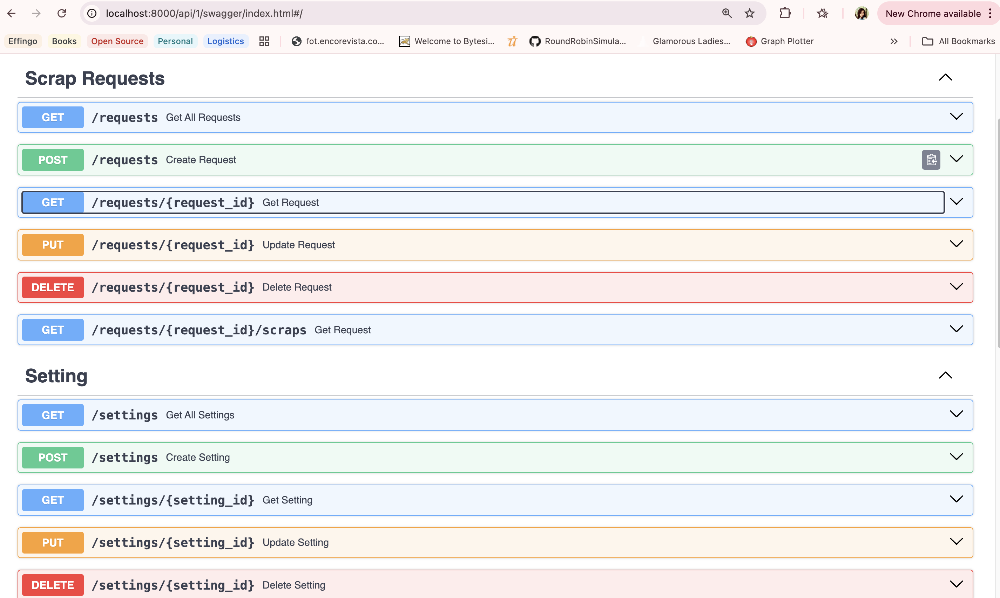

# Details on the Tool

This web scrapping tool is a generic API that allows one to scrap any data from any web site.
Currently API exposes two Controllers:
1. Settings - Setup meta information about website to scrap
2. Requests - Create Multiple requests to scrap data and save records



It is based on certain requirements that it expects and otherwise picks default settings.

## Tech Stack
The API is currently using following:

- FastAPI
- Docker
- Poetry
- MongoDB

As the app is dockerized, there is no need to setup database or any other additional infratstructure. Follow the local-setup process below to start the API.

### Steps to interact with the API:

1. Create a Settings for Web API to be scrapped. Example:

```json
        {
            "is_scrapping_paginated": true,
            "is_page_query_parameter": false,
            "max_pages_limit": 4,
            "name": "Shop site",
            "proxy": "",
            "base_url": "https://dentalstall.com/shop"
        }
```

Details on fields:

| Field Name | Type | Description |
|----------|----------|----------|
| is_scrapping_paginated | bool | To specify if data will be extracted from multiple pages |
| is_page_query_parameter | bool | To specify if page number needs to be appended as path or query parameter |
| max_pages_limit | int | Max number of pages that will be scrapped for the website |
| name | string | Name for the Setting. It is optional |
| proxy | string | Proxy |
| base_url | string | URL from where scrapping will be done |

2. Once setting has been created, we can create scrapping requests any number of time. The only dependency is to use an existing setting id ( received from step 1). Create a POST Request.

```json
        {
            "override_page_limit": 1,
            "setting_id": "673f91e7cc37fb918fd15f98",
            "name": "string",
            "status": "processed",
            "meta": {
            "root_selector": ".product-inner",
            "field_mappings": [
                {
                "field_name": "name",
                "mapped_to": ".woo-loop-product__title",
                "requires_fetch": false,
                "attribute_name": ""
                },
                {
                "field_name": "img_url",
                "mapped_to": ".mf-product-thumbnail img",
                "requires_fetch": false,
                "attribute_name": ""
                },
                {
                "field_name": "price",
                "mapped_to": ".woocommerce-Price-amount bdi:nth-of-type(1)",
                "requires_fetch": false,
                "attribute_name": ""
                }
            ],
            "is_multiple_items": true
            }
        }
```

Details on fields:

| Field Name | Type | Description |
|----------|----------|----------|
| override_page_limit | bool | To override number of pages to be scrapped for single request |
| setting_id | bool | Settings Id.(Preexisting) |
| status | int | Status of Request - Unprocessed, Pending, Processed |
| name | string | Name for the Setting. It is optional |
| meta | string | Meta information related to scrapping |
| is_multiple_items | bool | If items are multiple even on single page |


**Understanding Meta in detail:** 
The idea behind this API is to generalize the scrapping process as much as possible. So to make the scrapping easier, there are certain assumptions or decisions been made. It expects the following:

- root_selector : The root/parent under which all items lie. This is needed in case of multiple items been scrapped from single page/
- field_mappings : The mapping that needs to be done.
  - field_name: The name of field we will store in our Db. For eg: Price
  - mapped_to: Mapping class in HTML page under which data is present
  - requires_fetch: Whether the data is an image or some other file and needs to be downloaded.
  - attribute_name: Specify if there is an attribute from HTML tag that needs to be picked up. For eg: src attribute of img tag.


3. Once a request is created, it remains in unprocessed state. There is a separate background process, that will pick up unprocessed records from DB every few minutes. The items are downloaded and added into seperate collection in DB. The request transitions to processed.

4. All the records created can be seen under data call


## Generate env file

```sh
    bash local-setup/generate_env.sh
```

## Local Setup

```
    docker-compose up --build
```

Some systems currently support `docker compose` instead. 

The application should be available at http://localhost:8000/api/1/swagger/index.html


### Poetry process - Highly discouraged to use due to additional setup steps
To be able to setup run this app in debugger mode in VScode, the python interpretor needs to be setup correctly.

Use these steps to do so:

- Run `poetry install` to install packages
- Run `poetry env info --path` to get the path for the virtual environment created by poetry
- Set the intrepretor to the path outputted from above. To set this up, `View -> Command Pallete -> Python: Select Interpreter`.
- Run the project using debugger


**TODOs:**

| Issue                                                 | Status      |
|-------------------------------------------------------|-------------|
| Handle case where if setting id does not exist        | Done        |
| Handle case of not creating records multiple times    | Pending     |
| Handle File persistence                               | Pending     |
| Fix Get by Request Id Scraps                          | Done     |
| Add Filter by status                                  | Pending     |
| Error Handling                                        | Pending     |
| Retry mechanism                                       | Done        |
| Caching                                               | Pending     |
| Auth - Fix for delete                                 | Pending     |
| Avoid duplicates being saved (Files + DB records)     | Pending     |
